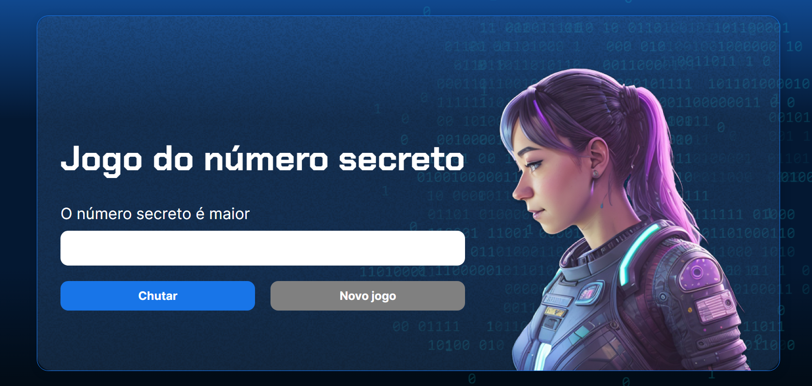

# Resolução da atividade *Alura*      
 ---  
 
    
 ## Índice
  - Descrição 
  - Como jogar
 ---

 ## Descrição      
 ---   
 ##### Um jogo onde você tenta adivinhar o número que o computador selecionou em segredo usando um algoritmo no curso da [Alura](https://www.alura.com.br/)

 
 
---
 ## Como jogar  
---
 Insira o número entre 1 e 40,
 O computador indicará se o número escolhido é maior ou menor que o número selecionado e dará uma dica
 Ao final quando o número escolhido for adivinhado será mostrado com o número de tentativas.   